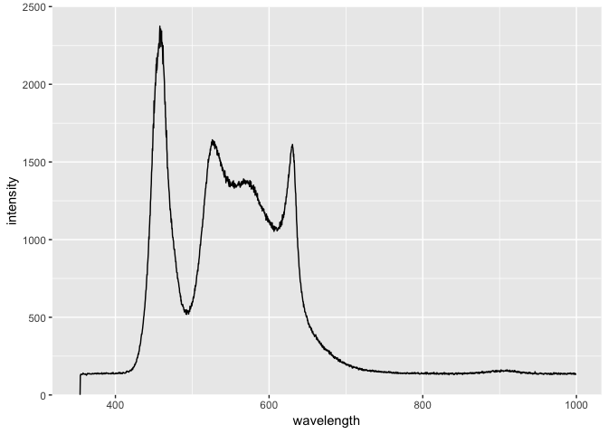

spectrum.data
================
daniellembecker
12/13/2018

Making graphs to show the spectrum gradient for blue light, multi light and both blue and multi light in terms of wavelenth and intensity
=========================================================================================================================================

clear list
==========

``` r
rm(list=ls())
```

set wd
======

``` r
setwd ("~/Desktop/Repositories/Light_Spectrum")
```

load libraries
==============

``` r
library(dplyr)
```

    ## 
    ## Attaching package: 'dplyr'

    ## The following objects are masked from 'package:stats':
    ## 
    ##     filter, lag

    ## The following objects are masked from 'package:base':
    ## 
    ##     intersect, setdiff, setequal, union

``` r
library(tidyr)
library(ggplot2)
```

load data
=========

``` r
mydata <- read.csv("~/Desktop/Repositories/Light_Spectrum/Data/bluelight.spectra.csv")
#View(mydata)
```

line graph of data for blue light spectrum
==========================================

``` r
ggplot(data=mydata, aes(x=wavelength, y=intensity)) + geom_line(aes(group=1)) + scale_y_continuous(expand=c(0,0), limits=c(0, 4000)) + scale_x_continuous(limits=c(350, 1000)) 
```

 \#For future use: \# Change color of both line and points \# Change line type and point type, and use thicker line and larger points \# Change points to circles with white fill \#ggplot(data=dat, aes(x=time, y=total\_bill, group=1)) + geom\_line(colour="red", linetype="dashed", size=1.5) + geom\_point(colour="red", size=4, shape=21, fill="white")

load data
=========

``` r
mydata <- read.csv("~/Desktop/Repositories/Light_Spectrum/Data/multilight.spectra.csv")
#View(mydata)
```

line graph of data for multi light spectrum
===========================================

``` r
ggplot(data=mydata, aes(x=wavelength, y=intensity)) + geom_line(aes(group=1))+ scale_y_continuous(expand=c(0,0), limits=c(0, 2500)) + scale_x_continuous(limits=c(350, 1000)) 
```



load data
=========

``` r
mydata <- read.csv("~/Desktop/Repositories/Light_Spectrum/Data/blueandmulti.spectra.csv")
#View(mydata)
```

line graph of data for both blue and multi light spectrum
=========================================================

``` r
ggplot(data=mydata, aes(x=wavelength, y=intensity)) + geom_line(aes(group=1)) + scale_y_continuous(expand=c(0,0), limits=c(0, 4000)) + scale_x_continuous(breaks = seq(350,1000,50))
```


